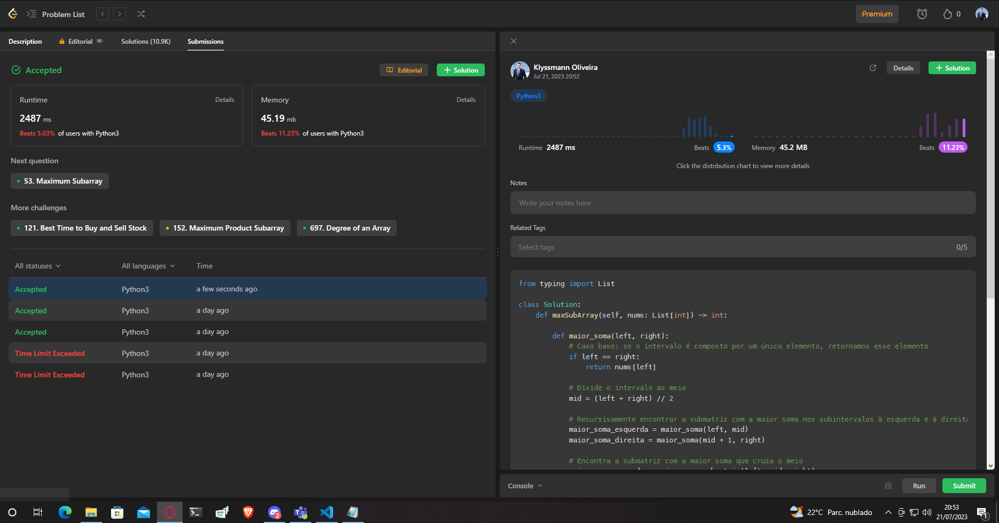

## 53. Maximum Subarray

Dado um array de inteiros **nums**, encontre a submatriz (subarray) com a maior soma e retorne essa soma.

### Exemplo 1:

**Input**: `nums = [-2,1,-3,4,-1,2,1,-5,4]`

**Output**: `6`

**Explicação**: A submatriz [4,-1,2,1] possui a maior soma 6.

### Exemplo 2:

**Input**: `nums = [1]`

**Output**: `1`

**Explicação**: A submatriz [1] possui a maior soma 1.

### Exemplo 3:

**Input**: `nums = [5,4,-1,7,8]`

**Output**: `23`

**Explicação**: A submatriz [5,4,-1,7,8] possui a maior soma 23.

### Restrições:

- 1 <= nums.length <= 10^5
- -10^4 <= nums[i] <= 10^4

### Desafio:

Se você já descobriu uma solução O(n), tente implementar outra solução usando a abordagem "Divisão e Conquista" (divide and conquer), que é mais sutil.

## Solução
[https://leetcode.com/problems/maximum-subarray/](https://leetcode.com/problems/maximum-subarray/)

