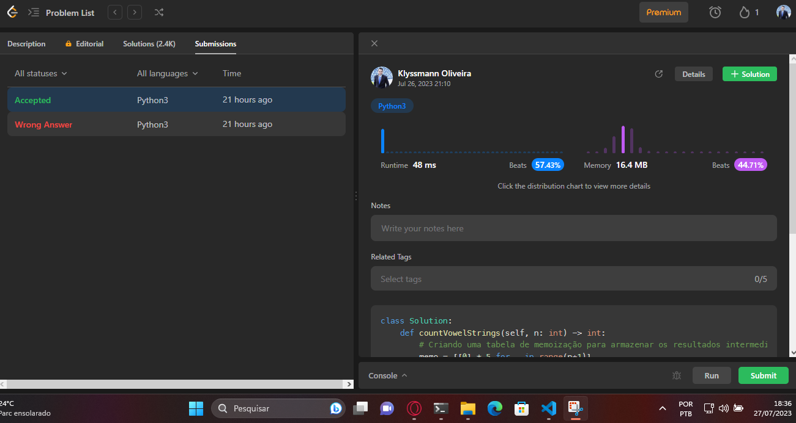

# 1641. Count Sorted Vowel Strings

1641. Contar Sequências Ordenadas de Vogais

Dado um número inteiro n, retorne a quantidade de strings de comprimento n que consistem apenas de vogais (a, e, i, o, u) e estão ordenadas lexicograficamente.

Uma string s está ordenada lexicograficamente se, para todos os índices válidos i, s[i] é igual ou vem antes de s[i+1] no alfabeto.

Exemplo 1:

Entrada: n = 1
Saída: 5
Explicação: As 5 strings ordenadas que consistem apenas de vogais são ["a","e","i","o","u"].

Exemplo 2:

Entrada: n = 2
Saída: 15
Explicação: As 15 strings ordenadas que consistem apenas de vogais são ["aa","ae","ai","ao","au","ee","ei","eo","eu","ii","io","iu","oo","ou","uu"].

Observe que "ea" não é uma string válida, pois 'e' vem depois de 'a' no alfabeto.

Exemplo 3:

Entrada: n = 33
Saída: 66045

Restrições:

1 <= n <= 50

## Solução
[https://leetcode.com/problems/count-sorted-vowel-strings/](https://leetcode.com/problems/count-sorted-vowel-strings/)

