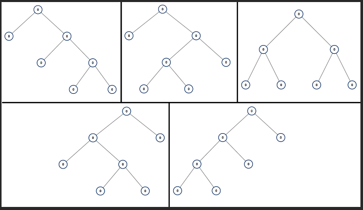
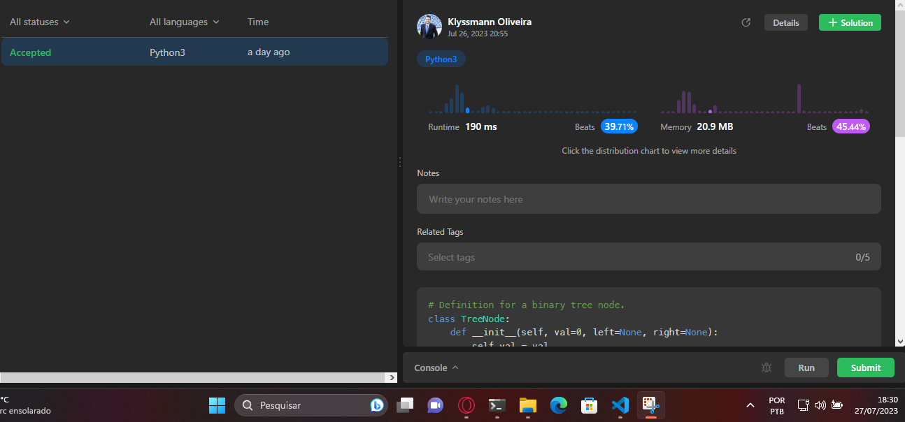

# 894. All Possible Full Binary Trees

894. Todas as Possíveis Árvores Binárias Completas

Dado um número inteiro n, retorne uma lista de todas as possíveis árvores binárias completas com n nós. Cada nó de cada árvore na resposta deve ter o valor Node.val == 0.

Cada elemento da resposta é o nó raiz de uma árvore possível. Você pode retornar a lista final de árvores em qualquer ordem.

Uma árvore binária completa é uma árvore binária onde cada nó tem exatamente 0 ou 2 filhos.

Exemplo 1:

Entrada: n = 7

Saída: [[0,0,0,null,null,0,0,null,null,0,0],[0,0,0,null,null,0,0,0,0],[0,0,0,0,0,0,0],[0,0,0,0,0,null,null,null,null,0,0],[0,0,0,0,0,null,null,0,0]]

Exemplo 2:

Entrada: n = 3

Saída: [[0,0,0]]

Restrições:

1 <= n <= 20
1 <= n <= 20

## Solução
[https://leetcode.com/problems/all-possible-full-binary-trees/description/](https://leetcode.com/problems/all-possible-full-binary-trees/description/)

