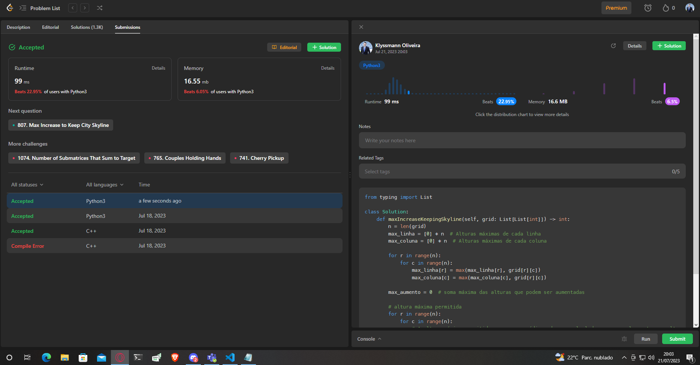

## 807. Max Increase to Keep City Skyline

Uma cidade é composta por blocos de tamanho n x n, onde cada bloco contém um único prédio em forma de um prisma vertical quadrado. Você recebe uma matriz inteira n x n indexada em 0, chamada **grid**, onde **grid[r][c]** representa a altura do prédio localizado no bloco na linha r e coluna c.

O horizonte da cidade é o contorno externo formado por todos os prédios quando visto lateralmente da cidade. O horizonte de cada direção cardeal norte, leste, sul e oeste pode ser diferente.

É permitido aumentar a altura de qualquer número de prédios em qualquer quantidade (a quantidade pode ser diferente para cada prédio). A altura de um prédio de altura 0 também pode ser aumentada. No entanto, aumentar a altura de um prédio não deve afetar o horizonte da cidade em qualquer direção cardeal.

Retorne a soma total máxima pela qual a altura dos prédios pode ser aumentada sem alterar o horizonte da cidade em qualquer direção cardeal.

### Exemplo 1:

Entrada: grid = [[3,0,8,4],[2,4,5,7],[9,2,6,3],[0,3,1,0]]
Saída: 35
Explicação: As alturas dos prédios são mostradas no centro da imagem acima.
Os horizontes quando vistos de cada direção cardeal estão desenhados em vermelho.
A matriz após aumentar a altura dos prédios sem afetar os horizontes é:
gridNew = [ [8, 4, 8, 7],
            [7, 4, 7, 7],
            [9, 4, 8, 7],
            [3, 3, 3, 3] ]

### Exemplo 2:

Entrada: grid = [[0,0,0],[0,0,0],[0,0,0]]
Saída: 0
Explicação: Aumentar a altura de qualquer prédio resultará na mudança do horizonte.

### Restrições:

n == grid.length
n == grid[r].length
2 <= n <= 50
0 <= grid[r][c] <= 100

## Solução
[https://leetcode.com/problems/max-increase-to-keep-city-skyline/description/](https://leetcode.com/problems/max-increase-to-keep-city-skyline/description/)

